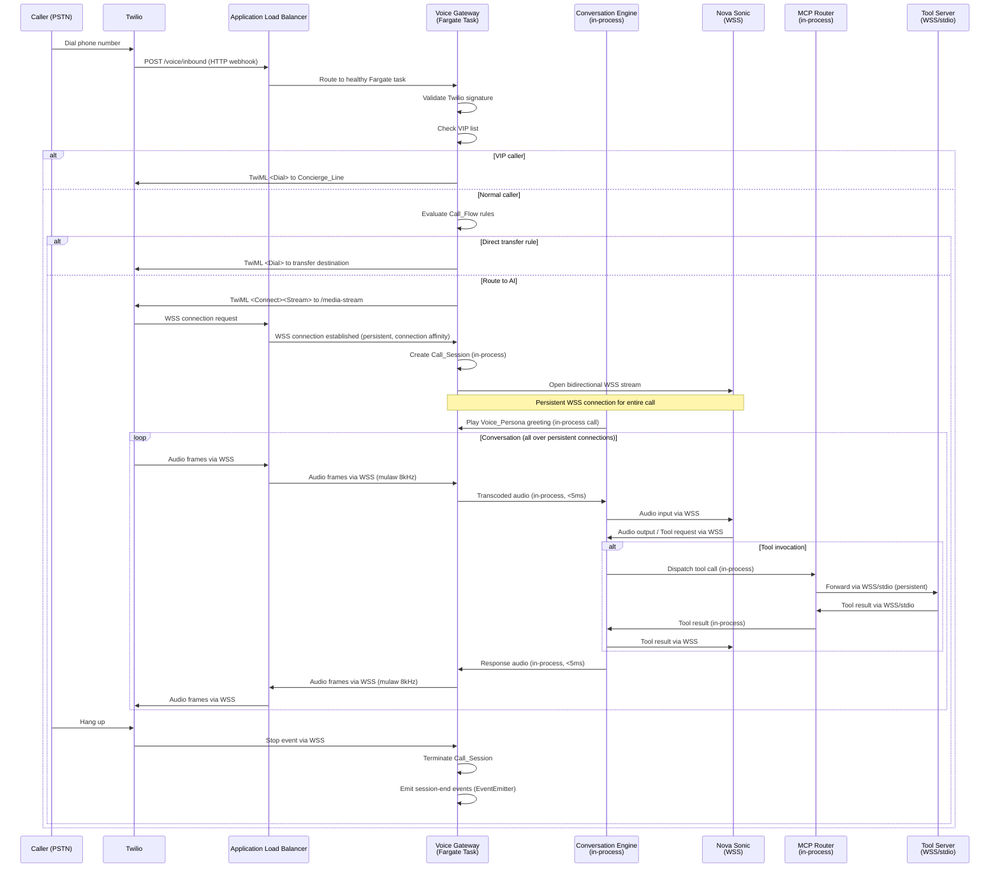

# Design Document: Twilio PSTN Voice Channel

## Overview

This design describes a telephony voice AI system that accepts inbound PSTN calls via Twilio, bridges audio to Amazon Nova Sonic for real-time speech-to-speech conversations, and routes tool invocations through MCP to manage restaurant reservations, inquiries, SMS follow-ups, VIP routing, feedback collection, analytics, and customizable voice personas.

The system is built as a Node.js/TypeScript application using the following core technologies:

- **Twilio Voice SDK** for PSTN call handling, TwiML generation, and SMS messaging
- **Amazon Nova Sonic** for bidirectional speech-to-speech streaming (WebSocket-based)
- **WebSocket (ws)** for all real-time communication paths (Twilio Media Streams, Nova Sonic, internal component messaging)
- **MCP (Model Context Protocol)** for tool invocation routing (via WebSocket or stdio connections)
- **AWS CDK** for infrastructure-as-code deployment
- **DynamoDB** for reservation, analytics, and configuration storage
- **CloudWatch** for metrics and logging (using Embedded Metric Format)
- **AWS X-Ray** for distributed tracing across Fargate tasks, Lambda functions, and DynamoDB calls
- **API Gateway + Lambda** for non-latency-sensitive endpoints (analytics API, SMS webhook, feedback timeout)
- **DynamoDB Streams** for event-driven feedback timeout processing
- **AWS Secrets Manager** for sensitive credentials (Twilio auth token, account SID)
- **SSM Parameter Store** for non-secret runtime configuration (feature flags, drain timeout, SMS provider selection)
- **Amazon SNS** as an optional SMS provider (configurable alternative to Twilio Messaging API)

### Key Design Decisions

1. **WebSocket-first, end-to-end**: The entire hot audio path — from Twilio Media Stream through Voice Gateway, Conversation Engine, and Nova Sonic — uses persistent WebSocket connections. HTTP request/response patterns are avoided on the real-time audio path to eliminate connection setup overhead and achieve ultra-low latency. HTTP is only used for non-latency-sensitive operations (webhooks, SMS API).
2. **In-process co-location for zero-hop latency**: The Voice Gateway, Session Manager, Conversation Engine, and MCP Router run as co-located modules within a single Node.js process per Fargate task. This eliminates network hops between components on the hot path, reducing inter-component communication to direct function calls and event emitters.
3. **ECS Fargate as the facade/compute layer**: Each Fargate task runs the full Node.js process (Voice Gateway, Conversation Engine, MCP Router co-located). Fargate provides serverless container management — no EC2 instances to manage. Tasks autoscale based on active connection count or CPU/memory utilization. Persistent WebSocket connections are maintained for the lifetime of each Fargate task. Fargate tasks focus exclusively on real-time audio processing — non-latency-sensitive workloads (analytics, SMS webhooks, feedback timeout) are offloaded to Lambda.
4. **Single-task session affinity**: Each Call_Session is handled entirely by one Fargate task. The ALB provides native connection-level affinity for WebSocket connections, ensuring all frames for a given connection route to the same task. No shared state between tasks is required for active calls.
5. **Audio transcoding in-process**: mulaw 8kHz ↔ Nova Sonic format transcoding happens synchronously in the same process to minimize latency.
6. **Event-driven SMS**: SMS messages are dispatched asynchronously via an event emitter on the Call_Session, decoupling SMS delivery from the conversation flow.
7. **Configuration-driven routing**: VIP lists, call flows, and voice personas are loaded from DynamoDB/config files and can be updated without redeployment.
8. **MCP tool servers via WebSocket/stdio**: MCP tool servers connect over persistent WebSocket or stdio connections (not HTTP) to avoid per-request connection setup overhead during voice conversations.
9. **Graceful scale-in with connection draining**: When scaling in, ECS uses connection draining — existing Call_Sessions complete before a task is terminated. The ALB target group deregistration delay is set to allow in-progress calls to finish naturally.
10. **Serverless-first for non-real-time workloads**: Analytics API, inbound SMS webhook, and feedback timeout processing are implemented as API Gateway + Lambda functions. This reduces Fargate task load, eliminates the need for in-process timers (which are lost on task restart), and leverages AWS-native serverless scaling.
11. **Secrets Manager for credentials, SSM for config**: Sensitive credentials (Twilio auth token, account SID) are stored in AWS Secrets Manager. Non-secret runtime configuration (feature flags, drain timeout, SMS provider selection) is stored in SSM Parameter Store. This allows runtime config changes without redeployment and follows AWS security best practices.
12. **DynamoDB VPC Endpoint**: A DynamoDB Gateway VPC Endpoint is used so all Fargate task DynamoDB access avoids the NAT Gateway, reducing latency and eliminating NAT costs for DynamoDB traffic. This applies to all DynamoDB operations from Fargate tasks (session recording, reservation CRUD, config loading, analytics writes).
13. **CloudWatch Embedded Metric Format (EMF)**: Custom metrics are published using EMF — metrics are embedded in structured log lines and extracted by CloudWatch automatically. This is more efficient than direct `PutMetricData` API calls and reduces API throttling risk.
14. **AWS X-Ray for distributed tracing**: X-Ray tracing is enabled across all compute layers — ECS Fargate tasks, Lambda functions, and DynamoDB calls. This provides end-to-end visibility into request flows, latency breakdowns, and error propagation across the entire system. The X-Ray daemon runs as a sidecar container in the Fargate task definition, and Lambda functions have active tracing enabled.
15. **Configurable SMS provider (SNS + Twilio)**: SMS sending supports both Amazon SNS and Twilio Messaging API as providers, selectable via SSM Parameter Store (`/voice-gateway/sms-provider`). Since Twilio is already in the stack for voice, using Twilio for SMS is reasonable. However, Amazon SNS is the AWS-native choice and may be preferred for cost or operational simplicity. The SMS Service uses a provider abstraction that routes to the configured backend.

### Latency Budget

The system targets an end-to-end audio round-trip latency of **under 500ms** from caller utterance to the start of the assistant's spoken response. The budget is allocated as follows:

| Segment | Target | Notes |
|---|---|---|
| Twilio PSTN → Media Stream (network) | ~100ms | Twilio infrastructure, not controllable |
| Media Stream → Voice Gateway (WebSocket) | <5ms | Persistent WSS connection |
| Audio transcoding (in-process) | <5ms | Synchronous, no network hop |
| Voice Gateway → Nova Sonic (WebSocket) | <10ms | Persistent bidirectional WebSocket stream |
| Nova Sonic processing | ~300ms | Model inference time, not controllable |
| Nova Sonic → Voice Gateway → Twilio (return path) | <20ms | Same persistent connections, reverse direction |
| MCP tool dispatch (when invoked) | <50ms | WebSocket/stdio to co-located or local tool servers |
| **Total (without tool call)** | **~440ms** | |
| **Total (with tool call + DynamoDB)** | **~500–600ms** | Tool calls add DynamoDB latency |

## Architecture

```mermaid
graph TB
    subgraph "Twilio Cloud"
        PSTN[PSTN Caller]
        TW[Twilio Platform]
    end

    subgraph "AWS"
        subgraph "API Gateway + Lambda"
            APIGW[API Gateway REST API]
            LAN[Lambda: Analytics API<br/>GET /api/analytics]
            LSMS[Lambda: SMS Webhook<br/>POST /sms/inbound]
            LFB[Lambda: Feedback Timeout<br/>DynamoDB Streams trigger]
        end

        subgraph "Secrets & Config"
            SM_SEC[Secrets Manager<br/>Twilio auth token, SID]
            SSM[SSM Parameter Store<br/>Feature flags, drain timeout,<br/>SMS provider selection]
        end

        subgraph "Observability"
            XRAY[AWS X-Ray<br/>Distributed tracing]
        end

        subgraph "VPC"
            subgraph "Public Subnets"
                ALB[Application Load Balancer<br/>WebSocket support<br/>Sticky sessions]
            end

            VPCE[DynamoDB Gateway<br/>VPC Endpoint]

            subgraph "Private Subnets"
                subgraph "ECS Cluster"
                    subgraph "Fargate Task (per task)"
                        subgraph "Voice Gateway"
                            WH[Webhook Handler<br/>POST /voice/inbound<br/>HTTP only for webhooks]
                            WS[WebSocket Server<br/>/media-stream]
                            VIP[VIP Router]
                            CF[Call Flow Evaluator]
                            SESM[Session Manager]
                        end

                        subgraph "Conversation Engine (in-process)"
                            NS[Nova Sonic Client<br/>Bidirectional WSS]
                            TC[Audio Transcoder<br/>Sync, in-process]
                            IH[Interruption Handler]
                        end

                        subgraph "MCP Router (in-process)"
                            MR[MCP Dispatcher]
                        end

                        subgraph "Services (in-process)"
                            SMS[SMS Service<br/>Async, non-blocking<br/>SNS or Twilio provider]
                            FB[Feedback Service<br/>Send survey on call end]
                            AN[Call Analytics Service<br/>Record to DynamoDB]
                        end
                    end
                    ASG[ECS Service Autoscaling<br/>Target tracking on<br/>active connections / CPU]
                end
            end
        end
    end

    subgraph "MCP Tool Servers"
        RT[Reservation Tool Server<br/>WSS/stdio]
        IT[Inquiry Tool Server<br/>WSS/stdio]
    end

    subgraph "Data Stores"
        DB[(DynamoDB<br/>Reservations, Config,<br/>CallRecords, FeedbackSurveys)]
        DBS[DynamoDB Streams<br/>FeedbackSurveys table]
        CW[CloudWatch<br/>Metrics via EMF & Logs]
    end

    subgraph "AWS Messaging"
        SNS_SMS[Amazon SNS<br/>SMS provider option]
    end

    PSTN -->|Dial| TW
    TW -->|HTTP Webhook| ALB
    ALB -->|Route to task| WH
    WH -->|TwiML + Stream| TW
    TW <-->|"WSS (persistent)"| ALB
    ALB <-->|"WSS (connection affinity)"| WS
    WH --> VIP
    WH --> CF
    VIP -->|Transfer TwiML| TW
    WS <-->|"In-process call"| SESM
    SESM <-->|"In-process call"| TC
    TC <-->|"WSS (persistent, bidirectional)"| NS
    NS -->|"In-process call"| MR
    MR <-->|"WSS/stdio (persistent)"| RT
    MR <-->|"WSS/stdio (persistent)"| IT
    RT -->|via VPC Endpoint| DB
    IT -->|via VPC Endpoint| DB
    SESM -->|"EventEmitter (in-process)"| SMS
    SESM -->|"EventEmitter (in-process)"| FB
    SESM -->|"EventEmitter (in-process)"| AN
    SMS -->|HTTP API| TW
    SMS -->|SNS Publish| SNS_SMS
    FB -->|HTTP API| TW
    AN -->|via VPC Endpoint| DB
    AN -->|EMF logs| CW
    ASG -.->|"Scale tasks"| SESM

    XRAY -.->|"Trace segments"| WH
    XRAY -.->|"Trace segments"| LAN
    XRAY -.->|"Trace segments"| LSMS
    XRAY -.->|"Trace segments"| LFB

    TW -->|"SMS Webhook"| APIGW
    APIGW --> LSMS
    APIGW --> LAN
    LSMS -->|Write feedback| DB
    LAN -->|Query CallRecords| DB

    DBS -->|Stream events| LFB
    LFB -->|Mark unanswered| DB

    SM_SEC -.->|"Loaded at startup"| WH
    SSM -.->|"Loaded at startup"| WH
    VPCE -.->|"Gateway endpoint"| DB
```



### ALB Configuration for WebSocket Support

The Application Load Balancer fronting the ECS Fargate cluster must be configured to support long-lived WebSocket connections:

| Setting | Value | Rationale |
|---|---|---|
| Idle timeout | 3600 seconds | Accommodate long-running call sessions (up to 1 hour) |
| Target group deregistration delay | 300 seconds | Allow in-flight calls to complete during scale-in |
| Health check path | `GET /health` | Lightweight HTTP health check on each Fargate task |
| Health check interval | 30 seconds | Detect unhealthy tasks promptly |
| Listener protocol | HTTPS (port 443) | TLS termination at ALB; WebSocket upgrade handled natively |
| Target group protocol | HTTP (port 8080) | ALB forwards to Fargate task's HTTP/WS port |
| Stickiness | Not required | WebSocket connections are inherently sticky at the TCP/connection level — ALB routes all frames on an established WebSocket to the same target |

The ALB natively supports WebSocket upgrades on HTTP/HTTPS listeners. Once the WebSocket handshake completes, the ALB maintains the connection to the same Fargate task for the lifetime of the connection. No cookie-based sticky sessions are needed.

### ECS Fargate Deployment Architecture

Each Fargate task runs the full Node.js application (Voice Gateway + Conversation Engine + MCP Router co-located) as a single container.

#### Task Definition

```typescript
// CDK construct reference
const taskDefinition = new ecs.FargateTaskDefinition(this, 'VoiceGatewayTask', {
  cpu: 1024,          // 1 vCPU
  memoryLimitMiB: 2048, // 2 GB
  runtimePlatform: {
    cpuArchitecture: ecs.CpuArchitecture.ARM64,
    operatingSystemFamily: ecs.OperatingSystemFamily.LINUX,
  },
});
```

| Resource | Value | Rationale |
|---|---|---|
| CPU | 1024 (1 vCPU) | Sufficient for audio transcoding + WebSocket management for ~50 concurrent calls |
| Memory | 2048 MiB (2 GB) | Headroom for in-memory session state, audio buffers, and Node.js heap |
| Architecture | ARM64 | Cost-effective for compute-bound workloads |
| Container image | ECR repository | Private registry for the application Docker image |
| X-Ray sidecar | AWS X-Ray daemon | Collects trace segments from the application and forwards to X-Ray service |

#### X-Ray Sidecar Container

The Fargate task definition includes an X-Ray daemon sidecar container for distributed tracing:

```typescript
taskDefinition.addContainer('xray-daemon', {
  image: ecs.ContainerImage.fromRegistry('amazon/aws-xray-daemon:latest'),
  cpu: 32,
  memoryReservationMiB: 64,
  portMappings: [{ containerPort: 2000, protocol: ecs.Protocol.UDP }],
  logging: ecs.LogDrivers.awsLogs({
    logGroup: xrayLogGroup,
    streamPrefix: 'xray',
  }),
});

// Grant X-Ray permissions to task role
taskDefinition.taskRole.addManagedPolicy(
  iam.ManagedPolicy.fromAwsManagedPolicyName('AWSXRayDaemonWriteAccess')
);
```

The application uses the AWS X-Ray SDK for Node.js to instrument:
- Incoming HTTP requests (Express middleware)
- Outgoing HTTP calls (Twilio API, Nova Sonic)
- DynamoDB operations (via AWS SDK instrumentation)
- WebSocket connections (custom subsegments)

#### ECS Service and Auto Scaling

```typescript
const service = new ecs.FargateService(this, 'VoiceGatewayService', {
  cluster,
  taskDefinition,
  desiredCount: 2,                    // Minimum 2 tasks for availability
  minHealthyPercent: 100,             // Never drop below desired during deployment
  maxHealthyPercent: 200,             // Allow double during rolling update
  assignPublicIp: false,             // Private subnets only
  enableExecuteCommand: true,         // For debugging
});

const scaling = service.autoScaleTaskCount({
  minCapacity: 2,
  maxCapacity: 20,
});

// Scale based on CPU utilization
scaling.scaleOnCpuUtilization('CpuScaling', {
  targetUtilizationPercent: 60,
  scaleInCooldown: Duration.seconds(300),
  scaleOutCooldown: Duration.seconds(60),
});

// Scale based on active connection count (custom metric)
scaling.scaleOnMetric('ConnectionScaling', {
  metric: activeConnectionsMetric,
  scalingSteps: [
    { upper: 20, change: -1 },   // Scale in when < 20 connections per task
    { lower: 40, change: +1 },   // Scale out when > 40 connections per task
    { lower: 80, change: +2 },   // Scale out faster when > 80 connections per task
  ],
  adjustmentType: autoscaling.AdjustmentType.CHANGE_IN_CAPACITY,
});
```

Auto-scaling policies:
- **CPU-based**: Target 60% CPU utilization. Scale-out cooldown 60s (react quickly to traffic spikes), scale-in cooldown 300s (avoid flapping).
- **Connection-based**: Custom CloudWatch metric published by each Fargate task reporting active Call_Session count. Step scaling adds/removes tasks based on connection thresholds.
- **Minimum capacity**: 2 tasks for high availability (one task can handle traffic if the other is replaced).
- **Maximum capacity**: 20 tasks (configurable per deployment).

#### Graceful Shutdown on Scale-In

When ECS scales in or performs a rolling deployment, the Fargate task receives a `SIGTERM` signal. The application handles this gracefully:

```typescript
process.on('SIGTERM', async () => {
  logger.info('SIGTERM received, starting graceful shutdown');

  // 1. Stop accepting new calls (deregister from ALB health check)
  server.close();
  healthCheckStatus = 'draining';

  // 2. Wait for active Call_Sessions to complete (up to drain timeout)
  const drainTimeoutMs = parseInt(process.env.DRAIN_TIMEOUT_MS || '120000'); // 2 min default
  const drainStart = Date.now();

  while (sessionManager.getActiveSessions().length > 0) {
    if (Date.now() - drainStart > drainTimeoutMs) {
      logger.warn('Drain timeout reached, force-terminating remaining sessions');
      for (const session of sessionManager.getActiveSessions()) {
        sessionManager.terminateSession(session.callSid, 'shutdown');
      }
      break;
    }
    await new Promise(resolve => setTimeout(resolve, 1000));
  }

  // 3. Close all MCP tool server connections
  await mcpRouter.disconnectAll();

  // 4. Exit cleanly
  logger.info('Graceful shutdown complete');
  process.exit(0);
});
```

The ALB target group deregistration delay (300s) works in concert with the application-level drain timeout:
- ALB stops sending new connections to the deregistering task immediately
- Existing WebSocket connections continue to route to the task
- The application drains active sessions up to its configurable timeout
- ECS waits for the `stopTimeout` (configured to match deregistration delay) before sending `SIGKILL`

#### VPC and Networking

```
VPC
├── Public Subnets (2 AZs)
│   └── Application Load Balancer
├── Private Subnets (2 AZs)
│   └── ECS Fargate Tasks
└── NAT Gateway (for outbound internet access from private subnets)
```

- Fargate tasks run in private subnets (no public IP)
- Outbound internet access via NAT Gateway (required for Twilio API, Nova Sonic endpoint)
- ALB in public subnets receives inbound traffic from Twilio

#### Security Groups

| Resource | Inbound | Outbound |
|---|---|---|
| ALB | 443 (HTTPS) from 0.0.0.0/0 | 8080 to Fargate task SG |
| Fargate Tasks | 8080 from ALB SG | 443 to 0.0.0.0/0 (Twilio API, Nova Sonic, MCP tool servers, SNS); DynamoDB via VPC Gateway Endpoint (no NAT); UDP 2000 to X-Ray daemon (localhost/sidecar) |
| DynamoDB | VPC Gateway Endpoint (no NAT traversal) | N/A |

#### DynamoDB VPC Gateway Endpoint

A DynamoDB Gateway VPC Endpoint is provisioned in the VPC so that all Fargate task DynamoDB access avoids the NAT Gateway. This applies to every DynamoDB operation from Fargate tasks: session recording, reservation CRUD, config loading (VIP list, call flow rules, voice personas), analytics writes, and feedback survey writes. This reduces latency for DynamoDB operations and eliminates NAT Gateway data processing costs for all DynamoDB traffic.

```typescript
vpc.addGatewayEndpoint('DynamoDbEndpoint', {
  service: ec2.GatewayVpcEndpointAwsService.DYNAMODB,
  subnets: [{ subnetType: ec2.SubnetType.PRIVATE_WITH_EGRESS }],
});
```

#### IAM Task Role

The ECS task execution role and task role are separated:

- **Execution role**: Pull container image from ECR, write logs to CloudWatch
- **Task role**: Runtime permissions for the application:
  - `bedrock:InvokeModelWithResponseStream` — Nova Sonic access
  - `dynamodb:GetItem`, `dynamodb:PutItem`, `dynamodb:Query`, `dynamodb:UpdateItem`, `dynamodb:DeleteItem` — DynamoDB tables
  - `logs:CreateLogStream`, `logs:PutLogEvents` — Application logs (metrics published via EMF in log lines)
  - `secretsmanager:GetSecretValue` — Read Twilio credentials and other secrets from Secrets Manager
  - `ssm:GetParameter` — Read non-secret configuration from SSM Parameter Store
  - `xray:PutTraceSegments`, `xray:PutTelemetryRecords`, `xray:GetSamplingRules`, `xray:GetSamplingTargets` — X-Ray tracing (via `AWSXRayDaemonWriteAccess` managed policy)
  - `sns:Publish` — Send SMS via Amazon SNS (when SNS is configured as the SMS provider)

#### ECR Repository

Container images are stored in a private ECR repository. The CI/CD pipeline builds, tags, and pushes images on each release. ECS pulls the image at task launch.

#### CloudWatch Integration

- **Log group**: `/ecs/voice-gateway` — All application logs from Fargate tasks (stdout/stderr)
- **Custom metrics via Embedded Metric Format (EMF)**: Metrics are embedded in structured log lines using the CloudWatch EMF specification. CloudWatch automatically extracts metrics from EMF-formatted log entries — no direct `PutMetricData` API calls needed. This is more efficient, avoids API throttling, and co-locates metrics with their log context.
  - Namespace: `VoiceGateway`
  - `ActiveConnections` (per task, used for auto-scaling)
  - `AudioLatencyMs` (p50, p95, p99)
  - `MCPToolInvocationCount`
  - `MCPToolLatencyMs`
  - `CallSessionDuration`

EMF log line example:
```json
{
  "_aws": {
    "Timestamp": 1234567890,
    "CloudWatchMetrics": [{
      "Namespace": "VoiceGateway",
      "Dimensions": [["TaskId"]],
      "Metrics": [{ "Name": "ActiveConnections", "Unit": "Count" }]
    }]
  },
  "TaskId": "task-abc123",
  "ActiveConnections": 42
}
```

- **Alarms**:
  - High CPU utilization (>80% sustained for 5 min)
  - High active connection count (>90% of capacity)
  - Error rate spike (>5% of requests returning 5xx)
  - Nova Sonic connection failures

### Communication Protocol Summary

| Path | Protocol | Rationale |
|---|---|---|
| Twilio → ALB (webhook) | HTTP POST | One-time call setup, not latency-sensitive |
| ALB → Fargate Task (webhook) | HTTP POST | ALB routes to healthy task |
| Twilio ↔ ALB ↔ Fargate Task (audio) | WSS (persistent) | Real-time bidirectional audio streaming; ALB provides native WebSocket connection affinity |
| Voice Gateway ↔ Conversation Engine | In-process function calls | Co-located in same Fargate task, zero network overhead |
| Conversation Engine ↔ Nova Sonic | WSS (persistent, bidirectional) | Nova Sonic's native streaming protocol |
| Conversation Engine → MCP Router | In-process function calls | Co-located, zero network overhead |
| MCP Router ↔ Tool Servers | WSS or stdio (persistent) | Avoids HTTP connection setup on hot path |
| Session Manager → Services (SMS, Feedback, Analytics) | In-process EventEmitter | Async, non-blocking, no network hop |
| SMS/Feedback Service → Twilio API | HTTP | Non-latency-sensitive, fire-and-forget |
| Analytics API (Lambda) | API Gateway → Lambda → DynamoDB | Serverless, not on hot path |
| SMS Webhook (Lambda) | API Gateway → Lambda → DynamoDB | Serverless, receives Twilio SMS callbacks |
| Feedback Timeout (Lambda) | DynamoDB Streams → Lambda → DynamoDB | Event-driven, replaces in-process timers |
| Fargate → Secrets Manager | HTTPS | Loaded at startup, cached in-process |
| Fargate → SSM Parameter Store | HTTPS | Loaded at startup, cached in-process |
| Fargate → X-Ray daemon (sidecar) | UDP (port 2000) | Trace segments forwarded to X-Ray service |
| SMS Service → Amazon SNS | HTTPS | AWS-native SMS provider option (when configured) |
| SMS Service → Twilio Messaging API | HTTPS | Twilio SMS provider option (when configured) |

### Request Flow: Inbound Call




## Components and Interfaces

### 1. Voice Gateway

The Voice Gateway is an Express.js HTTP server (for webhooks only) combined with a WebSocket server for real-time audio. It serves as the entry point for all Twilio interactions, running inside an ECS Fargate task behind an Application Load Balancer. The Voice Gateway, Session Manager, Conversation Engine, and MCP Router are co-located in a single Node.js process within each Fargate task to eliminate network hops on the hot audio path.

#### Webhook Handler (`POST /voice/inbound`)

```typescript
interface InboundCallRequest {
  CallSid: string;
  From: string;       // Caller phone number (E.164)
  To: string;         // Twilio phone number
  CallStatus: string;
}

// Returns TwiML XML response
function handleInboundCall(req: InboundCallRequest): TwiMLResponse;
```

Responsibilities:
- Validate Twilio request signature (`X-Twilio-Signature` header) using the auth token
- Check caller against VIP_List; if matched, return `<Dial>` TwiML to Concierge_Line
- Evaluate Call_Flow rules; if a direct transfer rule matches, return `<Dial>` TwiML
- Otherwise, return `<Connect><Stream url="wss://host/media-stream">` TwiML

#### WebSocket Media Stream Server (`/media-stream`)

```typescript
interface MediaStreamMessage {
  event: 'connected' | 'start' | 'media' | 'stop' | 'mark';
  sequenceNumber: string;
  streamSid?: string;
  start?: { callSid: string; tracks: string[]; mediaFormat: MediaFormat };
  media?: { track: string; chunk: string; timestamp: string; payload: string }; // base64 mulaw
}

interface MediaFormat {
  encoding: 'audio/x-mulaw';
  sampleRate: 8000;
  channels: 1;
}
```

Responsibilities:
- Accept WSS connections from Twilio
- Parse incoming media stream messages
- Route audio to/from the Conversation Engine via the Session Manager
- Send `clear` messages on interruption to flush Twilio's audio buffer
- Send heartbeat/mark messages to keep the connection alive

#### VIP Router

```typescript
interface VIPEntry {
  phoneNumber: string;  // E.164 format
  guestName: string;
  conciergeLine: string;
}

interface VIPRouter {
  isVIP(callerPhone: string): Promise<VIPEntry | null>;
  refreshList(): Promise<void>;
}
```

Loads VIP_List from DynamoDB (or config file in local dev). Refreshes periodically or on-demand.

#### Call Flow Evaluator

```typescript
interface CallFlowRule {
  id: string;
  priority: number;
  conditions: {
    timeOfDay?: { start: string; end: string };  // HH:mm format
    dayOfWeek?: number[];                          // 0=Sun, 6=Sat
    callerPattern?: string;                        // regex pattern
  };
  action: {
    type: 'transfer' | 'conversation_engine';
    destination?: string;  // phone number for transfer
  };
}

interface CallFlowEvaluator {
  evaluate(callerPhone: string, callTime: Date): CallFlowRule | null;
  validate(rules: CallFlowRule[]): ValidationResult;
  loadRules(): Promise<void>;
}
```

Evaluates rules in priority order. Returns the first matching rule. Validates rules at startup and logs errors for invalid configurations (overlapping time ranges, missing destinations). Falls back to default route-to-Conversation_Engine if validation fails.

### 2. Session Manager

```typescript
interface CallSession {
  callSid: string;
  streamSid: string;
  callerPhone: string;
  locationId: string;
  startTime: Date;
  endTime?: Date;
  terminationReason?: 'caller_hangup' | 'error' | 'transfer' | 'timeout';
  correlationId: string;  // UUID for logging/metrics
  novaSonicSessionId?: string;
  inquiryTopics: string[];
  reservationActions: ReservationAction[];
}

interface SessionManager {
  createSession(callSid: string, streamSid: string, callerPhone: string): CallSession;
  getSession(callSid: string): CallSession | undefined;
  terminateSession(callSid: string, reason: string): void;
  getActiveSessions(): CallSession[];
  on(event: 'session:created' | 'session:terminated' | 'reservation:completed' | 'inquiry:completed', handler: Function): void;
}
```

The Session Manager is an in-memory store of active Call_Sessions within a single Fargate task. It emits events that the SMS Service, Feedback Service, and Analytics Service subscribe to. Since each Call_Session lives entirely on one Fargate task (guaranteed by ALB connection-level affinity for WebSocket connections), no cross-task session state is needed.

The Session Manager also publishes the active session count as a CloudWatch custom metric (`ActiveConnections`), which the ECS Service auto-scaling policy uses to scale the number of Fargate tasks. During graceful shutdown (SIGTERM), the Session Manager is queried for active sessions to determine when draining is complete.

### 3. Conversation Engine

The Conversation Engine runs in-process with the Voice Gateway. Communication between the Voice Gateway and Conversation Engine is via direct function calls and callbacks — no network serialization or WebSocket overhead.

The Conversation Engine maintains a persistent bidirectional WebSocket connection to Nova Sonic for each active Call_Session. Nova Sonic's native protocol is WebSocket-based bidirectional streaming, so the entire audio pipeline from Twilio → Voice Gateway → Nova Sonic is WebSocket end-to-end.

```typescript
interface ConversationEngine {
  startSession(callSession: CallSession, voicePersona: VoicePersona): Promise<void>;
  sendAudio(callSid: string, audioChunk: Buffer): void;
  onAudioOutput(callSid: string, handler: (audio: Buffer) => void): void;
  onInterruption(callSid: string, handler: () => void): void;
  onToolRequest(callSid: string, handler: (req: ToolRequest) => Promise<ToolResult>): void;
  endSession(callSid: string): Promise<void>;
}

interface NovaSonicConnection {
  /** Persistent bidirectional WebSocket to Nova Sonic */
  ws: WebSocket;
  sessionId: string;
  state: 'connecting' | 'open' | 'closing' | 'closed';
  reconnectAttempts: number;
}

interface VoicePersona {
  name: string;
  greeting: string;
  toneDescriptors: string[];  // e.g., ["warm", "professional", "concise"]
  systemPrompt: string;       // Full system prompt for Nova Sonic
}
```

#### Audio Transcoder

```typescript
interface AudioTranscoder {
  mulawToNovaSonic(mulawBuffer: Buffer): Buffer;
  novaSonicToMulaw(novaSonicBuffer: Buffer): Buffer;
}
```

Handles conversion between Twilio's mulaw 8kHz mono format and Nova Sonic's expected audio format. Operates synchronously and in-process on small audio chunks (<5ms per transcode) to stay within the latency budget. No network hop — the transcoder is a pure function called directly by the Voice Gateway before forwarding audio to the Nova Sonic WebSocket.

#### Interruption Handler

When Nova Sonic signals an interruption (via the bidirectional WebSocket stream):
1. Calls `onInterruption` callback → Voice Gateway sends `clear` message to Twilio Media Stream WebSocket
2. Resets the audio output buffer
3. Begins processing the new caller utterance within 200ms of the interruption event

Because the Conversation Engine and Voice Gateway are in-process, the interruption signal propagates via direct callback with no serialization or network delay.

### 4. MCP Router

The MCP Router runs in-process with the Conversation Engine. When Nova Sonic issues a tool request, the Conversation Engine calls the MCP Router directly (no network hop). The MCP Router then dispatches to external MCP tool servers over persistent WebSocket or stdio connections to avoid per-request HTTP connection setup overhead.

```typescript
interface MCPToolConfig {
  name: string;
  transport: 'websocket' | 'stdio';
  serverUrl?: string;    // For WebSocket transport (e.g., "ws://localhost:3001/mcp")
  command?: string;       // For stdio transport (e.g., "node tools/reservation-server.js")
  args?: string[];        // For stdio transport
  timeoutMs: number;      // default: 10000
}

interface MCPToolConnection {
  config: MCPToolConfig;
  /** Persistent connection — WebSocket or stdio child process */
  ws?: WebSocket;
  process?: ChildProcess;
  state: 'connecting' | 'connected' | 'disconnected';
  pendingRequests: Map<string, { resolve: Function; reject: Function; timer: NodeJS.Timeout }>;
}

interface ToolRequest {
  toolName: string;
  parameters: Record<string, unknown>;
  idempotencyKey?: string;
}

interface ToolResult {
  success: boolean;
  data?: Record<string, unknown>;
  error?: { code: string; message: string };
}

interface MCPRouter {
  registerTool(config: MCPToolConfig): void;
  connect(toolName: string): Promise<void>;  // Establish persistent connection
  dispatch(request: ToolRequest): Promise<ToolResult>;
  loadConfig(configPath: string): void;
  disconnectAll(): Promise<void>;  // Cleanup on shutdown
}
```

Connection lifecycle:
- Tool server connections are established at startup (or on first use) and kept alive for the lifetime of the process
- WebSocket connections use ping/pong frames for keepalive
- stdio connections remain open as long as the child process is running
- If a connection drops, the router reconnects automatically before the next dispatch
- Dispatches to a disconnected tool server queue until reconnection (with timeout)

### 5. Reservation Tool Server

An MCP tool server exposing these endpoints:

```typescript
// MCP Tool: create_reservation
interface CreateReservationParams {
  guestName: string;
  partySize: number;
  date: string;        // YYYY-MM-DD
  time: string;        // HH:mm
  locationId: string;
  specialRequests?: string;
  idempotencyKey: string;
}

// MCP Tool: modify_reservation
interface ModifyReservationParams {
  reservationId: string;
  updates: Partial<Pick<CreateReservationParams, 'partySize' | 'date' | 'time' | 'specialRequests'>>;
}

// MCP Tool: cancel_reservation
interface CancelReservationParams {
  reservationId: string;
  idempotencyKey: string;
}

// MCP Tool: get_reservation
interface GetReservationParams {
  guestName?: string;
  date?: string;
  reservationId?: string;
}

// MCP Tool: check_availability
interface CheckAvailabilityParams {
  locationId: string;
  date: string;
  timeRange?: { start: string; end: string };
  partySize: number;
}

// MCP Tool: check_group_availability
interface CheckGroupAvailabilityParams {
  restaurantGroupId: string;
  date: string;
  partySize: number;
  excludeLocationId?: string;
}
```

Validation rules:
- `partySize` must be a positive integer
- `date` must not be in the past
- `time` must fall within the location's operating hours
- Idempotency enforced via `idempotencyKey` stored in DynamoDB with TTL

### 6. Inquiry Tool Server

An MCP tool server exposing:

```typescript
// MCP Tool: get_hours
interface GetHoursParams {
  locationId: string;
  date?: string;  // for holiday hours
}

// MCP Tool: get_menu
interface GetMenuParams {
  locationId: string;
  category?: string;       // e.g., "appetizers", "desserts"
  dietaryFilter?: string;  // e.g., "vegetarian", "gluten-free"
}

// MCP Tool: get_location
interface GetLocationParams {
  locationId: string;
}

interface LocationInfo {
  name: string;
  address: string;
  phone: string;
  mapUrl: string;
  coordinates: { lat: number; lng: number };
}
```

### 7. SMS Service

```typescript
type SMSProvider = 'twilio' | 'sns';

interface SMSProviderBackend {
  sendSMS(to: string, body: string): Promise<void>;
}

interface TwilioSMSProvider extends SMSProviderBackend {
  readonly provider: 'twilio';
}

interface SNSSMSProvider extends SMSProviderBackend {
  readonly provider: 'sns';
}

interface SMSService {
  sendReservationConfirmation(callerPhone: string, reservation: Reservation): Promise<void>;
  sendReservationUpdate(callerPhone: string, reservation: Reservation): Promise<void>;
  sendCancellationConfirmation(callerPhone: string, reservation: Reservation): Promise<void>;
  sendDirections(callerPhone: string, location: LocationInfo): Promise<void>;
  sendMenuLink(callerPhone: string, menuUrl: string): Promise<void>;
  sendFeedbackSurvey(callerPhone: string, correlationId: string): Promise<void>;
}
```

The SMS Service supports two provider backends, selectable via SSM Parameter Store (`/voice-gateway/sms-provider`):

- **Twilio Messaging API** (`twilio`): Uses the Twilio SDK already in the stack for voice. Sends SMS via Twilio's REST API. This is the default provider since Twilio is already handling voice.
- **Amazon SNS** (`sns`): Uses the AWS SDK `SNS.publish()` with `PhoneNumber` targeting. This is the AWS-native choice and avoids external API calls for SMS. Requires SNS SMS sandbox exit for production use.

The provider is loaded from SSM at startup and cached. Both providers implement the `SMSProviderBackend` interface, so the SMS Service is agnostic to the underlying transport. All sends are async with a 30-second SLA. Failures are logged with the Call_Session correlation ID and the provider-specific error code (Twilio error code or SNS error).

### 8. Feedback Service

```typescript
interface FeedbackService {
  sendSurvey(callerPhone: string, correlationId: string): Promise<void>;
  handleSurveyResponse(fromPhone: string, body: string): Promise<void>;
}

interface FeedbackRecord {
  correlationId: string;
  callerPhone: string;
  csatScore?: number;     // 1-5
  comment?: string;
  respondedAt?: Date;
  status: 'sent' | 'answered' | 'unanswered';
}
```

The Feedback Service sends surveys on call end (in-process, via EventEmitter). Survey responses are handled by the SMS Webhook Lambda (API Gateway + Lambda), not by the Fargate task. The 24-hour unanswered timeout is handled by DynamoDB Streams + Lambda:

1. When a feedback survey is sent, a record is written to the `FeedbackSurveys` DynamoDB table with a TTL set to 24 hours from creation.
2. When the TTL expires and DynamoDB deletes the record, the DynamoDB Stream triggers the Feedback Timeout Lambda.
3. The Lambda checks if the feedback was already answered (by querying `CallRecords`). If not, it marks the feedback as `unanswered` in the `CallRecords` table.

This approach is more reliable than in-process timers, which are lost if a Fargate task restarts or scales in.

### 9. Analytics API Lambda

The analytics API is implemented as an API Gateway + Lambda function, separate from the Fargate tasks. This is a query-only, non-latency-sensitive endpoint that doesn't need to run on the Fargate task.

```typescript
interface AnalyticsLambdaHandler {
  /** GET /api/analytics?startDate=...&endDate=...&locationId=... */
  handler(event: APIGatewayProxyEvent): Promise<APIGatewayProxyResult>;
}
```

The Lambda queries the `CallRecords` DynamoDB table and returns aggregated analytics (calls by period, reservation conversion rate, inquiry topics, average CSAT, peak hours). This reduces load on Fargate tasks, which focus exclusively on real-time audio.

### 10. SMS Webhook Lambda

The inbound SMS webhook for feedback responses is implemented as an API Gateway + Lambda function.

```typescript
interface SMSWebhookLambdaHandler {
  /** POST /sms/inbound — receives Twilio SMS webhooks */
  handler(event: APIGatewayProxyEvent): Promise<APIGatewayProxyResult>;
}
```

When a caller replies to a feedback survey SMS, Twilio sends a webhook to the API Gateway URL. The Lambda:
1. Validates the Twilio request signature
2. Parses the CSAT score (1–5) and optional comment from the SMS body
3. Matches the response to the original Call_Session via caller phone number (GSI on `FeedbackSurveys` table)
4. Records the feedback in the `CallRecords` table
5. Deletes the `FeedbackSurveys` record (preventing the timeout Lambda from marking it as unanswered)

### 11. Feedback Timeout Lambda

The feedback timeout is implemented as a DynamoDB Streams-triggered Lambda function on the `FeedbackSurveys` table.

```typescript
interface FeedbackTimeoutLambdaHandler {
  /** Triggered by DynamoDB Streams REMOVE events (TTL expiry) */
  handler(event: DynamoDBStreamEvent): Promise<void>;
}
```

When DynamoDB's TTL mechanism deletes an expired `FeedbackSurveys` record, the stream triggers this Lambda. The Lambda:
1. Checks the deleted record's `status` — if already `answered`, no action needed
2. If `status` is `sent` (unanswered), updates the corresponding `CallRecords` entry to set `feedbackStatus: 'unanswered'`

This replaces the in-process 24-hour timer, which would be lost on Fargate task restart or scale-in.

### 12. Call Analytics Service (In-Process)

The in-process Call Analytics Service records call data to DynamoDB during active sessions. It does NOT serve the analytics API (that's the Analytics API Lambda).

```typescript
interface CallAnalyticsService {
  recordCallStart(session: CallSession): Promise<void>;
  recordCallEnd(session: CallSession): Promise<void>;
  recordReservationAction(correlationId: string, action: ReservationAction): Promise<void>;
  recordInquiryTopic(correlationId: string, topic: string): Promise<void>;
  recordFeedback(correlationId: string, feedback: FeedbackRecord): Promise<void>;
}

interface AnalyticsFilter {
  startDate: string;
  endDate: string;
  locationId?: string;
}

interface AnalyticsReport {
  totalCalls: number;
  callsByPeriod: { hour: Record<string, number>; day: Record<string, number>; week: Record<string, number> };
  reservations: { created: number; modified: number; canceled: number; conversionRate: number };
  inquiryTopics: Record<string, number>;
  averageCsat: { daily: Record<string, number>; weekly: Record<string, number> };
  peakHours: { hour: string; count: number }[];
}
```

The `AnalyticsFilter` and `AnalyticsReport` interfaces are shared between the in-process analytics service (for recording) and the Analytics API Lambda (for querying). The Lambda uses these types to query DynamoDB and return aggregated results.


## Data Models

### Reservation

```typescript
interface Reservation {
  reservationId: string;       // UUID
  locationId: string;
  guestName: string;
  partySize: number;
  date: string;                // YYYY-MM-DD
  time: string;                // HH:mm
  specialRequests?: string;
  status: 'confirmed' | 'modified' | 'canceled';
  confirmationNumber: string;  // Human-readable (e.g., "RES-A1B2C3")
  createdAt: string;           // ISO 8601
  updatedAt: string;           // ISO 8601
  callerPhone: string;
  correlationId: string;       // Links to Call_Session
  idempotencyKey: string;
}
```

DynamoDB table: `Reservations`
- Partition key: `reservationId`
- GSI1: `locationId` + `date` (for availability queries)
- GSI2: `guestName` + `date` (for lookup by name)
- GSI3: `callerPhone` + `date` (for lookup by phone)

### Availability Slot

```typescript
interface AvailabilitySlot {
  locationId: string;
  date: string;          // YYYY-MM-DD
  time: string;          // HH:mm
  maxPartySize: number;
  remainingCapacity: number;
}
```

DynamoDB table: `AvailabilitySlots`
- Partition key: `locationId`
- Sort key: `date#time`

### Restaurant Location

```typescript
interface RestaurantLocation {
  locationId: string;
  restaurantGroupId: string;
  name: string;
  address: string;
  phone: string;
  mapUrl: string;
  coordinates: { lat: number; lng: number };
  operatingHours: Record<string, { open: string; close: string }>;  // day -> hours
  menuUrl: string;
  timezone: string;
}
```

DynamoDB table: `Locations`
- Partition key: `locationId`
- GSI1: `restaurantGroupId` (for cross-location queries)

### VIP Entry

```typescript
interface VIPEntry {
  phoneNumber: string;   // E.164
  guestName: string;
  conciergeLine: string; // E.164
  locationId?: string;   // Optional: location-specific VIP
}
```

DynamoDB table: `VIPList`
- Partition key: `phoneNumber`

### Call Flow Rule

```typescript
interface CallFlowRule {
  id: string;
  locationId: string;
  priority: number;
  conditions: {
    timeOfDay?: { start: string; end: string };
    dayOfWeek?: number[];
    callerPattern?: string;
  };
  action: {
    type: 'transfer' | 'conversation_engine';
    destination?: string;
  };
}
```

DynamoDB table: `CallFlowRules`
- Partition key: `locationId`
- Sort key: `priority`

### Voice Persona

```typescript
interface VoicePersona {
  locationId: string;
  name: string;
  greeting: string;
  toneDescriptors: string[];
  systemPrompt: string;
}
```

DynamoDB table: `VoicePersonas`
- Partition key: `locationId`

### Call Record (Analytics)

```typescript
interface CallRecord {
  correlationId: string;
  callSid: string;
  callerPhone: string;
  locationId: string;
  startTime: string;       // ISO 8601
  endTime: string;         // ISO 8601
  durationSeconds: number;
  terminationReason: string;
  inquiryTopics: string[];
  reservationActions: ReservationAction[];
  csatScore?: number;
  csatComment?: string;
  feedbackStatus: 'sent' | 'answered' | 'unanswered' | 'disabled';
}

interface ReservationAction {
  type: 'create' | 'modify' | 'cancel';
  reservationId: string;
  timestamp: string;
}
```

DynamoDB table: `CallRecords`
- Partition key: `correlationId`
- GSI1: `locationId` + `startTime` (for analytics queries)
- GSI2: `callerPhone` + `startTime`

### Idempotency Record

```typescript
interface IdempotencyRecord {
  idempotencyKey: string;
  result: ToolResult;
  createdAt: string;
  ttl: number;  // DynamoDB TTL, 24 hours from creation
}
```

DynamoDB table: `IdempotencyKeys`
- Partition key: `idempotencyKey`
- TTL attribute: `ttl`

### Feedback Record

```typescript
interface FeedbackRecord {
  correlationId: string;
  callerPhone: string;
  sentAt: string;
  csatScore?: number;
  comment?: string;
  respondedAt?: string;
  status: 'sent' | 'answered' | 'unanswered';
  timeoutAt: number;  // DynamoDB TTL for 24h unanswered check
}
```

DynamoDB table: `FeedbackSurveys`
- Partition key: `correlationId`
- GSI1: `callerPhone` (for matching inbound SMS responses)


## Correctness Properties

*A property is a characteristic or behavior that should hold true across all valid executions of a system — essentially, a formal statement about what the system should do. Properties serve as the bridge between human-readable specifications and machine-verifiable correctness guarantees.*

### Property 1: Inbound call TwiML contains Media Stream connection

*For any* valid inbound call request (with any call SID and caller phone number), the Voice_Gateway webhook handler SHALL return TwiML containing a `<Connect><Stream>` element pointing to the WebSocket media stream endpoint.

**Validates: Requirements 1.1**

### Property 2: Call_Session initialization contains all required fields

*For any* WebSocket `start` event with a call SID and caller phone number, the created Call_Session SHALL contain the call SID, caller phone number, a start timestamp, and a unique correlation identifier.

**Validates: Requirements 1.2, 5.1, 8.4**

### Property 3: Concurrent sessions are independent

*For any* N distinct call SIDs used to create N Call_Sessions concurrently, all N sessions SHALL exist independently, be retrievable by their respective call SIDs, and have distinct correlation identifiers.

**Validates: Requirements 1.4**

### Property 4: Audio transcoding round trip

*For any* valid mulaw 8kHz audio buffer, transcoding to Nova Sonic format and back to mulaw SHALL produce audio equivalent to the original input (within acceptable lossy codec tolerance).

**Validates: Requirements 2.1, 2.2**

### Property 5: Interruption clears output and sends flush

*For any* active Call_Session with buffered audio output, when an interruption event is detected, the Voice_Gateway SHALL clear the output buffer AND send a `clear` message to the Twilio Media Stream.

**Validates: Requirements 3.1, 3.2**

### Property 6: MCP tool dispatch routes to correct server

*For any* tool invocation request with a tool name that matches a registered MCP_Tool, the MCP_Router SHALL dispatch the request to the server URL associated with that tool name in the configuration.

**Validates: Requirements 4.1**

### Property 7: MCP tool errors are forwarded

*For any* error response from an MCP_Tool server, the MCP_Router SHALL return a ToolResult with `success: false` and the error details to the Conversation_Engine.

**Validates: Requirements 4.4**

### Property 8: MCP tool configuration loading

*For any* valid configuration file containing tool registrations, loading the configuration SHALL result in all specified tools being registered and dispatchable by the MCP_Router.

**Validates: Requirements 4.5**

### Property 9: Session termination on stop event

*For any* active Call_Session, when a `stop` event is received from the Media Stream, the session SHALL be terminated, no longer retrievable by call SID, and all associated resources (including the Nova Sonic session reference) SHALL be released.

**Validates: Requirements 5.2**

### Property 10: Configuration loading from environment variables and AWS services

*For any* set of required configuration values (Twilio credentials, Nova Sonic endpoint, port, feature flags), the configuration loader SHALL produce a valid configuration object with all fields populated — reading from environment variables in local dev, and from Secrets Manager (for secrets) and SSM Parameter Store (for non-secret config) in production.

**Validates: Requirements 6.3, 9.4**

### Property 11: Session log records contain required fields

*For any* Call_Session that starts and ends, the emitted log records SHALL contain the Twilio call SID, caller phone number, call duration, termination reason, and the session's correlation identifier.

**Validates: Requirements 8.1, 8.4**

### Property 12: Metrics emission for session activity

*For any* Call_Session activity (session start, session end, MCP tool invocation), the Voice_Gateway SHALL emit the corresponding metric (active session count, tool invocation count) tagged with the session's correlation identifier.

**Validates: Requirements 8.2**

### Property 13: Twilio signature validation

*For any* webhook request, the Voice_Gateway SHALL accept the request if and only if the `X-Twilio-Signature` header is valid for the request URL, body, and configured auth token.

**Validates: Requirements 9.1**

### Property 14: No audio persistence after session termination

*For any* terminated Call_Session, no raw audio data from that session SHALL remain in memory or on disk (unless explicit audio recording is configured).

**Validates: Requirements 9.3**

### Property 15: Reservation creation with valid data

*For any* valid reservation request (positive party size, future date, time within operating hours), the Reservation_Tool SHALL create a Reservation containing all provided fields and return a confirmation number.

**Validates: Requirements 10.1**

### Property 16: Reservation modification preserves identity

*For any* existing Reservation and valid modification request, the Reservation_Tool SHALL update only the specified fields while preserving the reservation ID and confirmation number.

**Validates: Requirements 10.2**

### Property 17: Reservation cancellation marks status

*For any* existing Reservation, cancellation SHALL set the status to `canceled` and the reservation SHALL no longer appear in availability queries as occupied capacity.

**Validates: Requirements 10.3**

### Property 18: Alternative slots offered when unavailable

*For any* reservation request where the requested date/time/party size has no availability at the preferred location, the Reservation_Tool SHALL return alternative Availability_Slots (from the same location or, if in a Restaurant_Group, from other locations).

**Validates: Requirements 10.5, 14.1**

### Property 19: Inquiry_Tool returns requested information

*For any* valid location ID and inquiry type (hours, menu, location), the Inquiry_Tool SHALL return a non-empty response containing the requested information for that location.

**Validates: Requirements 11.1, 11.2, 11.3**

### Property 20: Availability query returns only fitting slots

*For any* date, time range, and party size, the availability query SHALL return only Availability_Slots where `remainingCapacity >= partySize`.

**Validates: Requirements 11.4, 12.2**

### Property 21: Reservation data validation

*For any* reservation input, the Reservation_Tool SHALL reject requests where party size is not a positive integer, date is in the past, or time is outside operating hours, AND the error response SHALL name the invalid fields.

**Validates: Requirements 12.4, 12.5**

### Property 22: Reservation idempotency

*For any* create or cancel operation, invoking the operation twice with the same idempotency key SHALL produce the same result and SHALL NOT create duplicate reservations or perform the cancellation twice.

**Validates: Requirements 12.6**

### Property 23: Reservation SMS contains required details

*For any* successful reservation event (create, modify, or cancel), the SMS message body SHALL contain the relevant reservation details: confirmation number, date, time, party size, and restaurant address for creation/modification; original date and time for cancellation.

**Validates: Requirements 13.1, 13.2, 13.3**

### Property 24: Info-request SMS contains relevant content

*For any* directions request, the SMS SHALL contain the restaurant address and a map link. *For any* menu request, the SMS SHALL contain a link to the online menu.

**Validates: Requirements 13.4, 13.5**

### Property 25: Cross-location alternatives capped at three

*For any* cross-location availability query that returns results, the Conversation_Engine SHALL present at most three alternatives, each including the location name, address, and available times.

**Validates: Requirements 14.2**

### Property 26: Single-location skips cross-location search

*For any* restaurant that operates as a single Location with no Restaurant_Group, the system SHALL skip the cross-location availability search and only offer alternative times at the same location.

**Validates: Requirements 14.5**

### Property 27: VIP caller routing

*For any* inbound call where the caller's phone number matches an entry in the VIP_List, the Voice_Gateway SHALL return TwiML that transfers the call to the configured Concierge_Line, and SHALL log the caller phone, VIP entry, and target Concierge_Line.

**Validates: Requirements 15.1, 15.2, 15.5**

### Property 28: Feedback survey conditional sending

*For any* normally-ended Call_Session, a Feedback_Survey SMS SHALL be sent if and only if post-call feedback is enabled in the configuration.

**Validates: Requirements 16.1, 16.5**

### Property 29: Feedback response recording

*For any* valid survey response (CSAT score 1–5 with optional comment), the Call_Analytics_Service SHALL record the score and comment associated with the original Call_Session's correlation identifier.

**Validates: Requirements 16.3**

### Property 40: Feedback timeout marks unanswered via DynamoDB Streams

*For any* FeedbackSurveys record that expires via DynamoDB TTL without being answered, the Feedback Timeout Lambda SHALL update the corresponding CallRecords entry to set `feedbackStatus: 'unanswered'`.

**Validates: Requirements 16.4**

### Property 30: Call volume aggregation

*For any* set of call records, the Call_Analytics_Service SHALL correctly group and count calls by hour, day, and week.

**Validates: Requirements 17.1**

### Property 31: Reservation conversion rate calculation

*For any* set of call records containing reservation actions, the reservation conversion rate SHALL equal the number of reservations created divided by the total number of calls that included a reservation inquiry.

**Validates: Requirements 17.2**

### Property 32: Inquiry topic categorization

*For any* set of call records with inquiry topics, the Call_Analytics_Service SHALL correctly categorize and count each topic.

**Validates: Requirements 17.3**

### Property 33: Average CSAT calculation

*For any* set of feedback records with CSAT scores, the computed daily and weekly averages SHALL equal the arithmetic mean of the scores in each period.

**Validates: Requirements 17.4**

### Property 34: Peak call hours identification

*For any* set of call records in a week, the peak hours calculation SHALL return the top three one-hour periods with the highest call volume, sorted by volume descending.

**Validates: Requirements 17.5**

### Property 35: Analytics API filtering

*For any* date range and optional location filter, the analytics API SHALL return data that includes only call records within the specified date range and matching the location filter.

**Validates: Requirements 17.6**

### Property 36: Voice_Persona configuration loading

*For any* valid Voice_Persona configuration (with name, greeting, and tone descriptors), loading the configuration SHALL produce a VoicePersona object with all fields populated.

**Validates: Requirements 18.1**

### Property 37: Voice_Persona greeting used at session start

*For any* new Call_Session, the first audio output from the Conversation_Engine SHALL correspond to the configured Voice_Persona greeting message.

**Validates: Requirements 18.2**

### Property 38: Call flow rule evaluation

*For any* set of valid Call_Flow rules and any inbound call (with a given time, day, and caller phone number), the Call_Flow evaluator SHALL return the highest-priority matching rule, and if that rule specifies a transfer, the TwiML SHALL be a `<Dial>` to the transfer destination without initiating a Conversation_Engine session.

**Validates: Requirements 18.3, 18.4**

### Property 39: Invalid call flow configuration fallback

*For any* Call_Flow configuration containing invalid rules (overlapping time ranges, missing transfer destinations), the Voice_Gateway SHALL detect the invalidity at startup, log a validation error, and fall back to the default Call_Flow that routes all calls to the Conversation_Engine.

**Validates: Requirements 18.6**

### Property 41: SMS provider routing

*For any* SMS send request, the SMS Service SHALL route the message through the provider configured in SSM Parameter Store (`/voice-gateway/sms-provider`) — either Amazon SNS or Twilio Messaging API — and the message body SHALL be identical regardless of provider.

**Validates: Requirements 13.1, 13.2, 13.3, 13.4, 13.5**


## Error Handling

### Voice Gateway Errors

| Error Scenario | Handling Strategy | User Impact |
|---|---|---|
| Twilio signature validation failure | Reject request with 403, log attempt | Call not connected |
| WebSocket connection failure | Return TwiML with `<Say>` error message + `<Hangup>` | Caller hears error message |
| Invalid Call_Flow config at startup | Log validation error, fall back to default routing | Calls route to Conversation_Engine |
| VIP_List load failure | Log error, treat all callers as non-VIP | VIP callers go to AI instead of concierge |

### Conversation Engine Errors

| Error Scenario | Handling Strategy | User Impact |
|---|---|---|
| Nova Sonic WebSocket disconnect | Reconnect within 3 seconds using same WSS endpoint; if failed, play error message and end call | Brief pause, then either recovery or graceful termination |
| Nova Sonic WebSocket connection failure at session start | Return TwiML error response, terminate Call_Session | Caller hears error message |
| Audio transcoding error | Log error with correlation ID, skip corrupted frame | Possible brief audio glitch |
| Nova Sonic WebSocket backpressure | Buffer up to 500ms of audio; if exceeded, drop oldest frames and log warning | Possible brief audio gap |

### MCP Router Errors

| Error Scenario | Handling Strategy | User Impact |
|---|---|---|
| Tool server timeout (>10s) | Return timeout ToolResult to Conversation_Engine | Nova Sonic informs caller of temporary issue |
| Tool server error response | Forward error ToolResult to Conversation_Engine | Nova Sonic communicates failure naturally |
| Unregistered tool name | Return error ToolResult with "tool not found" | Nova Sonic informs caller it cannot perform the action |
| WebSocket/stdio connection lost to tool server | Auto-reconnect; queue pending requests with timeout | Brief delay, transparent if reconnect succeeds |
| Tool server process crash (stdio) | Restart child process, return error for in-flight requests | Nova Sonic informs caller of temporary issue |

### Reservation Tool Errors

| Error Scenario | Handling Strategy | User Impact |
|---|---|---|
| Invalid reservation data | Return descriptive error naming invalid fields | Nova Sonic asks caller to correct the information |
| Reservation not found for modify/cancel | Return not-found error | Nova Sonic offers to search with different details |
| No availability at requested time | Return alternative slots | Nova Sonic offers alternatives |
| Duplicate idempotency key | Return cached result from first invocation | Transparent to caller |
| DynamoDB write failure | Return error, log with correlation ID | Nova Sonic informs caller of temporary issue |

### SMS Service Errors

| Error Scenario | Handling Strategy | User Impact |
|---|---|---|
| Twilio SMS delivery failure | Log failure with correlation ID and Twilio error code | Caller does not receive SMS (no in-call notification) |
| Amazon SNS SMS delivery failure | Log failure with correlation ID and SNS error code | Caller does not receive SMS (no in-call notification) |
| Invalid phone number format | Log error, skip SMS send | No SMS sent |
| SMS provider misconfiguration | Log error at startup, fall back to Twilio provider | SMS sent via Twilio |

### Session Lifecycle Errors

| Error Scenario | Handling Strategy | User Impact |
|---|---|---|
| Unexpected WebSocket disconnect | Terminate Call_Session within 5 seconds, release resources | Call ends |
| Heartbeat timeout | Terminate Call_Session, log timeout | Call ends |
| Session cleanup failure | Log error, schedule retry cleanup | No user impact (resource leak logged) |

### General Error Handling Principles

1. All errors are logged with the Call_Session correlation identifier for traceability
2. User-facing errors are communicated through Nova Sonic's natural language (not raw error messages)
3. Resource cleanup is guaranteed via try/finally patterns in session lifecycle management
4. Transient errors (network, DynamoDB throttling) use exponential backoff retry
5. Fatal errors (unrecoverable state) trigger graceful call termination with an apology message

### Lambda Error Handling

| Error Scenario | Handling Strategy | User Impact |
|---|---|---|
| Analytics Lambda DynamoDB query failure | Return 500 with error message, log error | Dashboard shows error |
| SMS Webhook Lambda invalid Twilio signature | Return 403, log attempt | Feedback not recorded (security) |
| SMS Webhook Lambda invalid CSAT score | Log warning, ignore message | No feedback recorded |
| Feedback Timeout Lambda DynamoDB write failure | Retry via DynamoDB Streams retry policy (up to 3 attempts) | Feedback may remain in `sent` status |
| Secrets Manager access failure at startup | Fargate task fails health check, ECS replaces task | Brief capacity reduction |
| SSM Parameter Store access failure | Use cached/default values, log warning | Config may be stale |

### X-Ray Tracing Errors

| Error Scenario | Handling Strategy | User Impact |
|---|---|---|
| X-Ray daemon unavailable | Application continues without tracing, log warning | No tracing data (no functional impact) |
| X-Ray segment submission failure | Daemon retries automatically | Possible gaps in trace data |

## Testing Strategy

### Property-Based Testing

Property-based testing library: **fast-check** (TypeScript)

Each correctness property from the design document will be implemented as a single property-based test using fast-check. Tests will be configured with a minimum of 100 iterations per property.

Each test will be tagged with a comment in the format:
```
// Feature: twilio-pstn-voice-channel, Property {number}: {property_text}
```

Key property test areas:

1. **Audio Transcoding (Property 4)**: Generate random audio buffers, verify round-trip transcoding preserves audio within tolerance.

2. **Reservation Validation (Property 21)**: Generate random reservation inputs (including invalid ones), verify validation correctly accepts/rejects and names invalid fields.

3. **Reservation Idempotency (Property 22)**: Generate random create/cancel operations with idempotency keys, verify duplicate calls produce identical results.

4. **SMS Content (Properties 23, 24)**: Generate random reservations and location data, verify SMS bodies contain all required fields.

5. **Analytics Aggregation (Properties 30–35)**: Generate random sets of call records, verify grouping, counting, averaging, and filtering produce mathematically correct results.

6. **Call Flow Evaluation (Property 38)**: Generate random rule sets and inbound call parameters, verify the evaluator returns the correct highest-priority matching rule.

7. **Call Flow Validation (Property 39)**: Generate random invalid configurations, verify detection and fallback behavior.

8. **VIP Routing (Property 27)**: Generate random VIP lists and caller numbers, verify correct TwiML generation for VIP vs non-VIP callers.

9. **Twilio Signature Validation (Property 13)**: Generate random request URLs and bodies, compute valid/invalid signatures, verify accept/reject behavior.

10. **Cross-Location Availability (Properties 25, 26)**: Generate random restaurant groups with multiple locations and availability data, verify alternatives are capped at 3 and single-location restaurants skip cross-location search.

11. **Feedback Timeout (Property 40)**: Generate random expired FeedbackSurveys records, verify the Lambda correctly marks unanswered feedback in CallRecords.

12. **SMS Provider Routing (Property 41)**: Generate random SMS send requests with different provider configurations, verify the correct provider backend is used and message body is identical.

### Unit Testing

Unit tests complement property tests by covering specific examples, edge cases, and integration points:

- **Edge cases**: WebSocket connection failure TwiML response, Nova Sonic reconnection timeout, MCP tool timeout, reservation not found, empty availability, SMS delivery failure logging (both Twilio and SNS providers), VIP concierge line timeout fallback, invalid call flow config detection, Lambda cold start handling, DynamoDB Streams REMOVE event filtering, Secrets Manager access failure at startup, SSM Parameter Store missing parameter, X-Ray daemon unavailable (graceful degradation), invalid SMS provider config fallback to Twilio
- **Specific examples**: TwiML structure for a known inbound call, reservation creation with known inputs, SMS body for a known reservation (via Twilio provider), SMS body for a known reservation (via SNS provider), analytics report for a known dataset, Analytics Lambda response for a known date range, SMS Webhook Lambda parsing a known Twilio payload, Feedback Timeout Lambda processing a known expired record
- **Integration points**: Session Manager event emission on session create/terminate, SMS Service triggered by reservation events, Feedback Service triggered by session end events, Analytics Service recording from session events, API Gateway → Lambda integration for analytics and SMS webhook, DynamoDB Streams → Feedback Timeout Lambda, X-Ray trace propagation across Fargate → Lambda → DynamoDB

### Test Organization

```
tests/
├── unit/
│   ├── voice-gateway/
│   │   ├── webhook-handler.test.ts
│   │   ├── vip-router.test.ts
│   │   ├── call-flow-evaluator.test.ts
│   │   └── media-stream.test.ts
│   ├── conversation-engine/
│   │   ├── audio-transcoder.test.ts
│   │   └── interruption-handler.test.ts
│   ├── mcp-router/
│   │   └── dispatcher.test.ts
│   ├── tools/
│   │   ├── reservation-tool.test.ts
│   │   └── inquiry-tool.test.ts
│   ├── services/
│   │   ├── sms-service.test.ts
│   │   ├── feedback-service.test.ts
│   │   └── analytics-service.test.ts
│   ├── lambdas/
│   │   ├── analytics-api.test.ts
│   │   ├── sms-webhook.test.ts
│   │   └── feedback-timeout.test.ts
│   ├── config/
│   │   └── config-loader.test.ts
│   └── session/
│       └── session-manager.test.ts
├── property/
│   ├── audio-transcoding.prop.test.ts
│   ├── reservation-validation.prop.test.ts
│   ├── reservation-idempotency.prop.test.ts
│   ├── sms-content.prop.test.ts
│   ├── sms-provider-routing.prop.test.ts
│   ├── analytics-aggregation.prop.test.ts
│   ├── call-flow-evaluation.prop.test.ts
│   ├── vip-routing.prop.test.ts
│   ├── signature-validation.prop.test.ts
│   ├── cross-location-availability.prop.test.ts
│   ├── session-lifecycle.prop.test.ts
│   ├── inquiry-tool.prop.test.ts
│   ├── feedback-survey.prop.test.ts
│   └── feedback-timeout.prop.test.ts
└── integration/
    ├── twilio-webhook.integration.test.ts
    ├── call-session-flow.integration.test.ts
    └── reservation-flow.integration.test.ts
```

### Test Tooling

- **Test runner**: Vitest
- **Property-based testing**: fast-check (minimum 100 iterations per property)
- **Mocking**: Vitest built-in mocking for Twilio API, DynamoDB, Nova Sonic client, Amazon SNS, and X-Ray SDK
- **Integration tests**: Use local DynamoDB (dynamodb-local) and mock Twilio/Nova Sonic/SNS endpoints

### Infrastructure-as-Code (AWS CDK)

The deployment stack uses AWS CDK (TypeScript) with the following key constructs:

```typescript
// lib/voice-gateway-stack.ts
import * as cdk from 'aws-cdk-lib';
import * as ec2 from 'aws-cdk-lib/aws-ec2';
import * as ecs from 'aws-cdk-lib/aws-ecs';
import * as ecr from 'aws-cdk-lib/aws-ecr';
import * as elbv2 from 'aws-cdk-lib/aws-elasticloadbalancingv2';
import * as autoscaling from 'aws-cdk-lib/aws-applicationautoscaling';
import * as dynamodb from 'aws-cdk-lib/aws-dynamodb';
import * as logs from 'aws-cdk-lib/aws-logs';
import * as iam from 'aws-cdk-lib/aws-iam';
import * as lambda from 'aws-cdk-lib/aws-lambda';
import * as lambdaNodejs from 'aws-cdk-lib/aws-lambda-nodejs';
import * as apigateway from 'aws-cdk-lib/aws-apigateway';
import * as secretsmanager from 'aws-cdk-lib/aws-secretsmanager';
import * as ssm from 'aws-cdk-lib/aws-ssm';
import * as lambdaEventSources from 'aws-cdk-lib/aws-lambda-event-sources';

// VPC with public/private subnets across 2 AZs
const vpc = new ec2.Vpc(this, 'VoiceGatewayVpc', {
  maxAzs: 2,
  natGateways: 1,
});

// DynamoDB Gateway VPC Endpoint (Fargate → DynamoDB without NAT)
vpc.addGatewayEndpoint('DynamoDbEndpoint', {
  service: ec2.GatewayVpcEndpointAwsService.DYNAMODB,
  subnets: [{ subnetType: ec2.SubnetType.PRIVATE_WITH_EGRESS }],
});

// Secrets Manager — Twilio credentials and other secrets
const twilioSecret = new secretsmanager.Secret(this, 'TwilioSecret', {
  secretName: 'voice-gateway/twilio',
  description: 'Twilio auth token, account SID, and other sensitive credentials',
});

// SSM Parameter Store — non-secret runtime configuration
new ssm.StringParameter(this, 'FeedbackEnabledParam', {
  parameterName: '/voice-gateway/feedback-enabled',
  stringValue: 'true',
  description: 'Enable/disable post-call feedback surveys',
});

new ssm.StringParameter(this, 'DrainTimeoutParam', {
  parameterName: '/voice-gateway/drain-timeout-ms',
  stringValue: '120000',
  description: 'Graceful shutdown drain timeout in milliseconds',
});

new ssm.StringParameter(this, 'SmsProviderParam', {
  parameterName: '/voice-gateway/sms-provider',
  stringValue: 'twilio',
  description: 'SMS provider: "twilio" or "sns"',
});

// ECR repository for container images
const repository = new ecr.Repository(this, 'VoiceGatewayRepo', {
  repositoryName: 'voice-gateway',
  removalPolicy: cdk.RemovalPolicy.RETAIN,
});

// ECS Cluster
const cluster = new ecs.Cluster(this, 'VoiceGatewayCluster', { vpc });

// Fargate Task Definition
const taskDef = new ecs.FargateTaskDefinition(this, 'VoiceGatewayTask', {
  cpu: 1024,
  memoryLimitMiB: 2048,
});

// Task role permissions: Nova Sonic, DynamoDB, CloudWatch Logs, Secrets Manager, SSM, X-Ray, SNS
twilioSecret.grantRead(taskDef.taskRole);
taskDef.taskRole.addToPrincipalPolicy(new iam.PolicyStatement({
  actions: ['ssm:GetParameter'],
  resources: ['arn:aws:ssm:*:*:parameter/voice-gateway/*'],
}));
taskDef.taskRole.addManagedPolicy(
  iam.ManagedPolicy.fromAwsManagedPolicyName('AWSXRayDaemonWriteAccess')
);
taskDef.taskRole.addToPrincipalPolicy(new iam.PolicyStatement({
  actions: ['sns:Publish'],
  resources: ['*'],  // SNS SMS uses PhoneNumber targeting, not topic ARN
}));
// (DynamoDB, Bedrock, and CloudWatch Logs permissions also added — see IAM Task Role section)

// Container
taskDef.addContainer('voice-gateway', {
  image: ecs.ContainerImage.fromEcrRepository(repository),
  portMappings: [{ containerPort: 8080 }],
  logging: ecs.LogDrivers.awsLogs({
    logGroup: new logs.LogGroup(this, 'VoiceGatewayLogs', {
      logGroupName: '/ecs/voice-gateway',
      retention: logs.RetentionDays.TWO_WEEKS,
    }),
    streamPrefix: 'ecs',
  }),
  environment: {
    SECRET_ARN: twilioSecret.secretArn,
    SSM_PREFIX: '/voice-gateway',
    AWS_XRAY_DAEMON_ADDRESS: 'localhost:2000',
  },
  stopTimeout: cdk.Duration.seconds(300),
});

// X-Ray daemon sidecar container
taskDef.addContainer('xray-daemon', {
  image: ecs.ContainerImage.fromRegistry('amazon/aws-xray-daemon:latest'),
  cpu: 32,
  memoryReservationMiB: 64,
  portMappings: [{ containerPort: 2000, protocol: ecs.Protocol.UDP }],
  logging: ecs.LogDrivers.awsLogs({
    logGroup: new logs.LogGroup(this, 'XRayDaemonLogs', {
      logGroupName: '/ecs/voice-gateway-xray',
      retention: logs.RetentionDays.ONE_WEEK,
    }),
    streamPrefix: 'xray',
  }),
});

// ALB with WebSocket support
const alb = new elbv2.ApplicationLoadBalancer(this, 'VoiceGatewayAlb', {
  vpc,
  internetFacing: true,
  idleTimeout: cdk.Duration.seconds(3600),
});

const targetGroup = new elbv2.ApplicationTargetGroup(this, 'VoiceGatewayTG', {
  vpc,
  port: 8080,
  protocol: elbv2.ApplicationProtocol.HTTP,
  targetType: elbv2.TargetType.IP,
  deregistrationDelay: cdk.Duration.seconds(300),
  healthCheck: {
    path: '/health',
    interval: cdk.Duration.seconds(30),
  },
});

alb.addListener('HttpsListener', {
  port: 443,
  certificates: [certificate],
  defaultTargetGroups: [targetGroup],
});

// ECS Fargate Service
const service = new ecs.FargateService(this, 'VoiceGatewayService', {
  cluster,
  taskDefinition: taskDef,
  desiredCount: 2,
  assignPublicIp: false,
});
service.attachToApplicationTargetGroup(targetGroup);

// Auto Scaling
const scaling = service.autoScaleTaskCount({ minCapacity: 2, maxCapacity: 20 });
scaling.scaleOnCpuUtilization('CpuScaling', {
  targetUtilizationPercent: 60,
  scaleInCooldown: cdk.Duration.seconds(300),
  scaleOutCooldown: cdk.Duration.seconds(60),
});

// DynamoDB tables (Reservations, AvailabilitySlots, Locations, etc.)
// ... defined per Data Models section

// FeedbackSurveys table with DynamoDB Streams enabled
const feedbackTable = new dynamodb.Table(this, 'FeedbackSurveys', {
  partitionKey: { name: 'correlationId', type: dynamodb.AttributeType.STRING },
  timeToLiveAttribute: 'timeoutAt',
  stream: dynamodb.StreamViewType.OLD_IMAGE, // Stream TTL-deleted items
  removalPolicy: cdk.RemovalPolicy.DESTROY,
});
feedbackTable.addGlobalSecondaryIndex({
  indexName: 'callerPhone-index',
  partitionKey: { name: 'callerPhone', type: dynamodb.AttributeType.STRING },
});

// --- API Gateway + Lambda Functions ---

// Analytics API Lambda
const analyticsLambda = new lambdaNodejs.NodejsFunction(this, 'AnalyticsLambda', {
  entry: 'src/lambdas/analytics-api.ts',
  handler: 'handler',
  runtime: lambda.Runtime.NODEJS_20_X,
  architecture: lambda.Architecture.ARM_64,
  timeout: cdk.Duration.seconds(30),
  memorySize: 256,
  tracing: lambda.Tracing.ACTIVE,  // X-Ray active tracing
  environment: {
    CALL_RECORDS_TABLE: callRecordsTable.tableName,
  },
});
callRecordsTable.grantReadData(analyticsLambda);

// SMS Webhook Lambda
const smsWebhookLambda = new lambdaNodejs.NodejsFunction(this, 'SmsWebhookLambda', {
  entry: 'src/lambdas/sms-webhook.ts',
  handler: 'handler',
  runtime: lambda.Runtime.NODEJS_20_X,
  architecture: lambda.Architecture.ARM_64,
  timeout: cdk.Duration.seconds(10),
  memorySize: 256,
  tracing: lambda.Tracing.ACTIVE,  // X-Ray active tracing
  environment: {
    FEEDBACK_TABLE: feedbackTable.tableName,
    CALL_RECORDS_TABLE: callRecordsTable.tableName,
    SECRET_ARN: twilioSecret.secretArn,
  },
});
feedbackTable.grantReadWriteData(smsWebhookLambda);
callRecordsTable.grantReadWriteData(smsWebhookLambda);
twilioSecret.grantRead(smsWebhookLambda);

// Feedback Timeout Lambda (DynamoDB Streams trigger)
const feedbackTimeoutLambda = new lambdaNodejs.NodejsFunction(this, 'FeedbackTimeoutLambda', {
  entry: 'src/lambdas/feedback-timeout.ts',
  handler: 'handler',
  runtime: lambda.Runtime.NODEJS_20_X,
  architecture: lambda.Architecture.ARM_64,
  timeout: cdk.Duration.seconds(30),
  memorySize: 256,
  tracing: lambda.Tracing.ACTIVE,  // X-Ray active tracing
  environment: {
    CALL_RECORDS_TABLE: callRecordsTable.tableName,
  },
});
callRecordsTable.grantReadWriteData(feedbackTimeoutLambda);
feedbackTimeoutLambda.addEventSource(
  new lambdaEventSources.DynamoEventSource(feedbackTable, {
    startingPosition: lambda.StartingPosition.TRIM_HORIZON,
    batchSize: 10,
    retryAttempts: 3,
    filters: [
      lambda.FilterCriteria.filter({
        eventName: lambda.FilterRule.isEqual('REMOVE'),
        userIdentity: { type: lambda.FilterRule.isEqual('Service'), principalId: lambda.FilterRule.isEqual('dynamodb.amazonaws.com') },
      }),
    ],
  }),
);

// API Gateway REST API
const api = new apigateway.RestApi(this, 'VoiceGatewayApi', {
  restApiName: 'Voice Gateway API',
  description: 'Analytics and SMS webhook endpoints',
});

const analyticsResource = api.root.addResource('api').addResource('analytics');
analyticsResource.addMethod('GET', new apigateway.LambdaIntegration(analyticsLambda));

const smsResource = api.root.addResource('sms').addResource('inbound');
smsResource.addMethod('POST', new apigateway.LambdaIntegration(smsWebhookLambda));
```

Key CDK constructs used:
- `aws-cdk-lib/aws-ecs` — `FargateTaskDefinition`, `FargateService`, `Cluster`
- `aws-cdk-lib/aws-elasticloadbalancingv2` — `ApplicationLoadBalancer`, `ApplicationTargetGroup`
- `aws-cdk-lib/aws-applicationautoscaling` — Auto-scaling policies
- `aws-cdk-lib/aws-ecr` — `Repository` for container images
- `aws-cdk-lib/aws-ec2` — `Vpc`, security groups, DynamoDB Gateway VPC Endpoint
- `aws-cdk-lib/aws-dynamodb` — Table definitions with Streams
- `aws-cdk-lib/aws-logs` — `LogGroup` for CloudWatch Logs
- `aws-cdk-lib/aws-iam` — Task role and execution role policies (including `AWSXRayDaemonWriteAccess`)
- `aws-cdk-lib/aws-lambda` — Lambda functions with X-Ray active tracing (analytics, SMS webhook, feedback timeout)
- `aws-cdk-lib/aws-lambda-nodejs` — `NodejsFunction` for TypeScript Lambda bundling
- `aws-cdk-lib/aws-apigateway` — REST API with Lambda integrations
- `aws-cdk-lib/aws-secretsmanager` — `Secret` for Twilio credentials
- `aws-cdk-lib/aws-ssm` — `StringParameter` for runtime configuration (feature flags, SMS provider)
- `aws-cdk-lib/aws-lambda-event-sources` — DynamoDB Streams event source for Lambda
- `aws-cdk-lib/aws-sns` — SNS topic/publish permissions for SMS provider option

